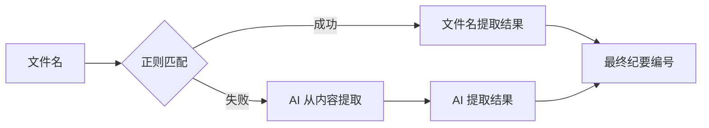
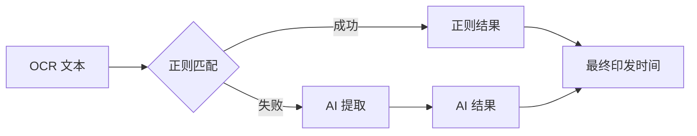

# 会议纪要助手 — 开发者文档

**版本：** 1.0.0  
**项目标识：** `meeting-minutes-tool`  
**许可证：** GPL-3.0+

---

## 1. 系统架构

### 1.1 架构总览

```
┌─────────────────────────────────────────────────────┐
│                     main.py                          │
│  ┌─────────────────────────────────────────────────┐ │
│  │              Application 类                      │ │
│  │  ┌──────────┐ ┌──────────┐ ┌──────────────────┐ │ │
│  │  │ 配置页    │ │ 热力图   │ │ 统计页           │ │ │
│  │  │ (⚙️)    │ │ (📊)    │ │ (📈)            │ │ │
│  │  └────┬─────┘ └──────────┘ └──────────────────┘ │ │
│  │       │  watcher_service                          │ │
│  └───────┼──────────────────────────────────────────┘ │
└──────────┼────────────────────────────────────────────┘
           │
    ┌──────▼──────────────────────────────────────────┐
    │                 watcher.py                        │
    │  ┌────────────┐ ┌──────────┐ ┌────────────────┐  │
    │  │ 文件监控    │ │ 扫描调度 │ │ 缓存管理       │  │
    │  │ (Observer)  │ │ (Worker) │ │ (MD5/OCR/LLM) │  │
    │  └────────────┘ └──────────┘ └────────────────┘  │
    └──────┬──────────────┬───────────────────────────┘
           │              │
    ┌──────▼─────┐  ┌────▼────────┐
    │  ocr_utils  │  │ llm_utils   │
    │  (百度 OCR) │  │ (DeepSeek)  │
    └────────────┘  └────┬────────┘
                         │
                   ┌─────▼─────────┐
                   │  excel_utils   │
                   │  (openpyxl)    │
                   └───────────────┘
```

### 1.2 模块职责

| 模块 | 职责 | 外部依赖 |
|------|------|----------|
| `main.py` | GUI 界面、配置管理、生命周期控制 | tkinter, PIL, pystray |
| `watcher.py` | 文件监控、任务调度、缓存控制、处理管线 | watchdog, PyMuPDF |
| `ocr_utils.py` | 百度 OCR API 封装 | requests |
| `llm_utils.py` | DeepSeek API 封装、提示词管理、数据解析 | requests |
| `excel_utils.py` | Excel 读写、格式化、备份恢复 | openpyxl |
| `heatmap_view.py` | 热力图可视化 | tkinter, openpyxl |
| `statistics_view.py` | 统计表格视图 | tkinter, PyMuPDF |
| `count_pdfs.py` | 独立脚本，统计 PDF 数量和页数 | PyMuPDF |

### 1.3 模块间接口

```
main.py ──config dict──→ watcher.py
                ↓
main.py ──watcher_service──→ watcher.WatcherService
                ↓
watcher.py ──ocr_client──→ ocr_utils.BaiduOCR
watcher.py ──deepseek_key──→ llm_utils.extract_minutes()
watcher.py ──output_dir──→ excel_utils.append_records()
watcher.py ──output_dir──→ excel_utils.delete_records_by_source()
                ↓
main.py ──config dict──→ heatmap_view.HeatmapView
main.py ──config dict──→ statistics_view.StatisticsView
```

---

## 2. 核心模块规格说明

### 2.1 main.py — 主程序入口

**类：`Application`**

```
Application(root: tk.Tk)
├── 属性
│   ├── watcher_service: WatcherService | None
│   ├── config: dict                     # 配置数据内存副本
│   ├── tray_icon: pystray.Icon | None
│   └── tray_thread: Thread | None
├── 方法
│   ├── load_config()                    # 从 config.json 加载
│   ├── _save_config()                   # 界面→config.json
│   ├── _import_config()                 # 从外部 JSON 导入到界面
│   ├── _export_config()                 # 界面→外部 JSON
│   ├── _validate_config(config) → bool  # 校验必填字段
│   ├── _start_monitor()                 # 创建并启动 WatcherService
│   ├── _stop_monitor()                  # 停止 WatcherService
│   ├── _on_closing()                    # 关闭→最小化到托盘
│   └── _force_quit()                    # 退出程序
└── UI 方法
    ├── _build_monitor_tab()             # 配置页（⚙️）
    ├── _build_heatmap_tab()             # 热力图页（📊）
    └── _build_statistics_tab()           # 统计页（📈）
```

**配置加载策略：**

```python
import sys, os

if hasattr(sys, 'frozen'):           # PyInstaller 打包
    CONFIG_DIR = EXE_DIR
elif 运行于 deb 包安装路径:
    CONFIG_DIR = ~/.config/meeting-minutes-tool/
else:                                 # 源码开发模式
    CONFIG_DIR = 项目根目录
```

**文本日志处理器：`TextHandler(logging.Handler)`**
- 接收标准 logging 记录
- 通过 `widget.after(0, ...)` 线程安全写入 ScrolledText 控件
- 自动滚动到底部

### 2.2 watcher.py — 文件监控与处理管线

**类：`WatcherService`**

```
WatcherService(folder, config, log_func)
├── start()
│   ├── 创建 Observer（watchdog）→ 设置 MonitorHandler
│   ├── 启动 worker_loop 线程（daemon=False）
│   └── 启动 Observer
├── stop()
│   ├── 设置 _stop_event
│   ├── job_queue.put(None)     # 发送退出信号
│   ├── worker_thread.join(5)
│   ├── observer.stop()
│   └── observer.join(5)
└── 内部状态
    ├── observer: Observer
    ├── job_queue: Queue[PDFJob | None]
    ├── worker_thread: Thread
    ├── _running: bool
    └── _stop_event: Event
```

**类：`MonitorHandler(FileSystemEventHandler)`**

| 事件 | 行为 |
|------|------|
| `on_created` | PDF 文件创建 → 延迟 2s → 入队 `PDFJob` |
| `on_deleted` | PDF 文件删除 → 入队 `__DELETE__:path` |

**核心函数：`process_single_pdf()`**

```
输入:  pdf_path, config, ocr_client, log_func,
       temp_image_dir, output_dir, watch_folder,
       force_reprocess=False

管线:
  1. detect_meeting_type_from_path()   → meeting_type
  2. detect_year_from_path()           → year
  3. 缓存检查
  4. pdf_to_images()                   → image_paths[]
  5. ocr_client.recognize(img_path)    → page_text (逐页)
  6. extract_minutes(full_text, key)   → minutes_data
  7. append_records(output_dir, ...)   → Excel 写入

输出:  bool (是否成功)
```

**数据类：`PDFJob`**

```python
@dataclass
class PDFJob:
    file_path: str      # PDF 文件路径（"__DELETE__:path" 表示删除）
    timestamp: float    # 文件创建/修改时间戳
```

**文件发现流程：`initial_scan_and_process()`**

```
1. rename_all_pdfs()        ← 统一括号格式，返回 {rel_path: info}
2. 检查 Excel 是否存在
   ├── 否 → restore_from_backup() → 有备份则恢复并跳过
   │         └── 无备份 → rebuild from _cache/ 或全量重新处理
   └── 是 → 继续
3. load_scan_record()       ← 加载上次记录
4. 对比识别变更
   ├── 新增文件 → 逐个 process_single_pdf()
   ├── 修改文件 → MD5 校验 → 变化则删除旧记录 → process_single_pdf()
   └── 删除文件 → 删除 Excel 行 + 删除缓存
5. save_scan_record()       ← 保存新记录
```

### 2.3 ocr_utils.py — 百度 OCR 封装

**类：`BaiduOCR`**

```python
BaiduOCR(api_key, secret_key)
├── _ensure_token()
│   └── POST /oauth/2.0/token → 获取/刷新 access_token
│       └── 过期策略：30天有效期，提前60秒自动刷新
├── recognize(image_path) → str
│   ├── 读取图片 → base64 编码
│   ├── POST /rest/2.0/ocr/v1/general_basic
│   └── 返回 words_result[] 拼接成的完整文本
└── 状态
    ├── access_token: str
    └── token_expire_time: float
```

### 2.4 llm_utils.py — DeepSeek API 封装

**函数：`extract_minutes(ocr_text, api_key, filename) → dict`**

```
输入:
  ocr_text  — OCR 识别出的完整文本
  api_key   — DeepSeek API 密钥
  filename  — 文件名（用于类型检测和纪要号正则提取）

处理流程:
  1. detect_meeting_type(filename)      → "party" | "board" | "gm" | "unknown"
  2. extract_record_number_from_filename() → 优先从文件名正则提取
  3. extract_publish_date_from_text()    → 优先从文本正则提取
  4. 获取对应类型的 system_prompt
  5. POST https://api.deepseek.com/v1/chat/completions
  6. _parse_json_response(content)       → JSON 解析（含 fallback）
  7. 合并会议类型信息和 publish_date

输出: dict {
    "record_number": str,    # 纪要编号，如 "〔2026〕10号"
    "meeting_info": {        # 会议信息
        "date": str,         # 会议日期
        "presider": str,     # 主持人
        "meeting_name": str  # 会议名称
    },
    "items": [               # 议题列表
        {"title": str, "content": str}
    ],
    "publish_date": str,     # 印发时间
    "meeting_type": str,     # 内部类型代码
    "meeting_type_name": str # 中文类型名
}
```

**三种会议类型的提取差异：**

| 类型 | 系统提示词常量 | 议题结构特点 | 印发时间格式 |
|------|--------------|-------------|-------------|
| 党委会 | `SYSTEM_PROMPT_PARTY` | 议定事项(一)(二)(三)... + 传达学习 | `XXXX年XX月XX日印发` |
| 董事会 | `SYSTEM_PROMPT_BOARD` | 一、二、三... 含党委意见+投票结果 | `XXXX年XX月XX日` |
| 总经办 | `SYSTEM_PROMPT_GM` | 督查落实(一)(二)... + 研究事项(一)(二)... | `XXXX年XX月XX日` |

**JSON 解析函数 `_parse_json_response(content)`：**
1. 尝试直接 `json.loads()`
2. 失败 → 提取 markdown 代码块 `\`\`\`json ... \`\`\``
3. 失败 → 正则提取最外层 `{...}`
4. 全部失败 → 返回空结构 + 日志错误

**纪要编号提取策略（双保险）：**



**印发时间提取策略（三保险）：**



### 2.5 excel_utils.py — Excel 读写

**函数式接口：**

```python
get_excel_path(output_dir) → str
    # 查找已有文件，或生成新文件名 "会议纪要汇总_YYYYMMDD_HHmmss.xlsx"

get_backup_dir(output_dir) → str
    # 返回 output_dir/_excel_backup/

backup_excel(output_dir)
    # 复制当前 Excel 到 _excel_backup/ 目录

restore_from_backup(output_dir) → bool
    # 从最近备份恢复

append_records(output_dir, record_number, items, meeting_type,
               meeting_info, source_file, year, publish_date) → str
    # 追加数据 → 排序 → 备份 → 保存

delete_records_by_source(output_dir, meeting_type, source_file) → bool
    # 按来源文件名删除行
```

**Excel 文件结构：**

```
会议纪要汇总_YYYYMMDD_HHmmss.xlsx
├── 党委会 Sheet
│   ├── 行1: 表头（冻结首行）
│   └── 行2+: 数据（按年份+纪要号排序）
├── 董事会 Sheet
│   └── ...
└── 总经办 Sheet
    └── ...
```

**表头样式：**
- 字体：微软雅黑 11pt 加粗，白色
- 背景色：#4472C4
- 列宽：[22, 16, 12, 8, 8, 40, 60, 18, 40]

**排序算法：**
```python
_extract_sort_key(record_number, year) → (int, int)
    # 从 "党委会〔2026〕4号" 提取 (2026, 4)
```

### 2.6 heatmap_view.py — 热力图

- 显示 1-50 号纪要的热力图网格
- 网格：5 行 × 10 列，每格 72×72 像素
- 颜色映射：党委会→蓝(#4A90D9)，董事会→橙(#E67E22)，总经办→绿(#2ECC71)
- 点击事件：打开对应 PDF 文件（使用系统默认 PDF 阅读器）
- 数据源：读取 Excel 文件

### 2.7 statistics_view.py — 统计视图

- 按年份 × 会议类型交叉统计
- 统计指标：PDF 文件数量 / 总页数
- 页数统计：通过 PyMuPDF 读取 PDF 文件页数
- 可选启用"统计页数"复选框

---

## 3. 数据处理流程

### 3.1 完整处理管线

```
[文件事件]
    │
    ▼
rename_all_pdfs()        # 统一文件名括号格式
    │
    ▼
[缓存检查]
    │
    ├── 缓存命中 (MD5 匹配) ──→ 直接使用缓存的 OCR 文本和 LLM 结果
    │                          跳过步骤 1/2/3
    │
    └── 缓存未命中
         │
         ▼
    pdf_to_images()       # PyMuPDF，300 DPI，每页一图
         │
         ▼
    BaiduOCR.recognize()  # 逐页 OCR，拼接完整文本
         │
         ▼
    extract_minutes()     # DeepSeek API 提取结构化数据
         │
         ▼
    append_records()      # 写入 Excel（含排序和备份）
         │
         ▼
    save_scan_record()    # 更新扫描记录
```

### 3.2 错误处理策略

| 场景 | 处理方式 | 恢复机制 |
|------|----------|----------|
| OCR API 调用失败 | 记录错误日志，不阻塞其他文件 | 下次全量扫描重新尝试 |
| DeepSeek API 调用失败 | 记录错误日志，不阻塞其他文件 | 下次全量扫描重新尝试 |
| Excel 被占用 | 重试 5 次，间隔 2 秒 | 关闭 Excel 后自动重试 |
| Excel 被删除 | 下次启动自动恢复 | 从备份或缓存重建 |
| PDF 无法打开 | 记录错误日志，跳过该文件 | 修复后全量扫描重新处理 |
| 网络超时 | 抛出异常，由上层捕获 | 下次全量扫描重新尝试 |
| JSON 解析失败 | 回退到次级解析策略 | 提取代码块 → 提取大括号 → 返回空 |

### 3.3 缓存策略

**缓存层级：**

```
文件 MD5 指纹 (.md5)
    ├── 用于判断文件内容是否变化
    │
    ├── OCR 文本缓存 (.ocr.txt)
    │   └── 跳过耗时最长的 OCR 步骤
    │
    └── LLM 结果缓存 (.result.json)
        └── 跳过 AI 提取步骤
```

**缓存失效条件：**
1. 文件 MD5 变化（内容被修改）
2. 强制重新处理（`force_reprocess=True`）
3. 缓存文件不完整（部分文件被删除）

---

## 4. 配置管理

### 4.1 配置文件 `config.json`

```json
{
    "watch_folder": "string",      // 监听目录路径（必填）
    "output_dir": "string",        // Excel 输出目录（必填）
    "api_key": "string",           // 百度 OCR AK（必填）
    "secret_key": "string",        // 百度 OCR SK（必填）
    "deepseek_key": "string",      // DeepSeek API Key（必填）
    "count_pages": "boolean"       // 统计页数开关（可选，默认 true）
}
```

### 4.2 配置加载优先级

1. 程序启动 → `load_config()` 从 `config.json` 加载
2. 用户编辑界面 → 点击"保存配置" → 写回 `config.json`
3. "开始监听"时自动保存当前配置

---

## 5. 构建与部署

### 5.1 依赖清单

`requirements.txt`（位于项目根目录）：

```
PyMuPDF>=1.23.0
requests>=2.31.0
openpyxl>=3.1.0
watchdog>=4.0.0
Pillow>=10.0.0
pystray>=0.19.0        # 可选，系统托盘支持
```

### 5.2 Windows PyInstaller 打包

```powershell
py -m PyInstaller --onefile --windowed --name "MeetingMinutesAssistant" ^
  --hidden-import=watchdog --hidden-import=watchdog.events ^
  --hidden-import=fitz --hidden-import=requests ^
  --hidden-import=openpyxl --hidden-import=PIL ^
  --hidden-import=PIL._imagingtk --hidden-import=PIL.Image ^
  --hidden-import=ocr_utils --hidden-import=llm_utils ^
  --hidden-import=excel_utils --hidden-import=watcher ^
  --distpath "dist" --workpath "build" --specpath "." ^
  "meeting_minutes_tool/main.py"
```

也可以通过 `.spec` 文件构建：

```powershell
py -m PyInstaller 会议纪要助手.spec
```

### 5.3 Linux DEB 包构建

```bash
# 运行打包脚本（在 Debian/Ubuntu 系统上）
chmod +x meeting_minutes_tool/build_deb.sh
./meeting_minutes_tool/build_deb.sh
```

脚本 `build_deb.sh` 自动执行：
1. 创建 DEBIAN 控制文件
2. 复制 Python 源码到 `/usr/lib/meeting-minutes-tool/`
3. 创建启动脚本 `/usr/bin/meeting-minutes-tool`
4. 创建 `.desktop` 文件和应用图标
5. 构建 `.deb` 包

**DEB 包安装后处理（`postinst`）：**
- 自动安装 pip 依赖
- 更新桌面数据库
- 更新图标缓存

---

## 6. 项目结构

```
项目根目录/
├── .gitignore
├── README.md
├── MeetingMinutesAssistant.spec   # PyInstaller 打包配置
├── requirements.txt               # Python 依赖清单
├── build_deb.sh                   # DEB 包构建脚本
├── meeting_minutes_tool/
│   ├── __init__.py
│   ├── main.py                    # 主程序入口，GUI 界面
│   ├── watcher.py                 # 文件监控与处理管线
│   ├── ocr_utils.py               # 百度 OCR API 封装
│   ├── llm_utils.py               # DeepSeek API 封装
│   ├── excel_utils.py             # Excel 读写
│   ├── export_view.py             # 导出视图
│   ├── heatmap_view.py            # 热力图视图
│   ├── statistics_view.py         # 统计表格视图
│   ├── 用户文档.md                 # 用户使用说明
│   ├── 开发者文档.md               # 本文件
│   └── resources/
│       └── icon.ico               # Windows 图标
├── 开发者文档.md                  # 本文件
└── 用户文档.md                    # 用户使用说明
```

---

## 7. 运行时数据文件

| 文件/目录 | 位置 | 用途 |
|-----------|------|------|
| `config.json` | 见 §4.2 配置路径 | 持久化配置 |
| `scan_record.json` | 监听目录根 | 已处理文件记录 |
| `_cache/` | 监听目录根 | OCR 文本和 LLM 结果缓存 |
| `_temp_images/` | 监听目录根 | PDF 转图片临时文件（处理完自动清理）|
| `_excel_backup/` | 输出目录 | Excel 备份 |

---

## 8. 设计决策

### 8.1 为什么使用 watchdog 而非轮询？

- watchdog 基于操作系统文件事件（Windows: ReadDirectoryChangesW，Linux: inotify），响应更快，CPU 占用更低
- 与全量扫描配合：实时事件处理增量变化，启动时全量扫描处理存量文件

### 8.2 为什么使用双保险/三保险提取策略？

纪要编号和印发时间是结构化信息中的关键字段：
- **纪要编号：** 文件名正则 → AI 提取，优先级递减
- **印发时间：** 文本正则 → AI 提取，优先级递减
- 正则提取准确但适用范围有限，AI 提取灵活但可能出错，两者互补

### 8.3 为什么 MD5 缓存而非 mtime 缓存？

- mtime 在文件复制过程中可能变化（取决于复制工具）
- MD5 校验确保内容级别的精确匹配
- 代价是每次全量扫描需要读取文件计算 MD5，但相对于 OCR/AI 处理的耗时可以忽略

### 8.4 为什么使用多级缓存策略？

- OCR 和 AI 调用是主要性能瓶颈（每个文件 1-3 分钟）
- 缓存命中时可在毫秒级完成处理
- 分三级缓存（MD5 + OCR + LLM）：部分缓存命中也能节省时间

### 8.5 工作线程设计

```python
# watcher.py — watcher_service.start()
worker_thread = Thread(target=worker_loop, daemon=False)
```

- 使用 `daemon=False`：确保工作线程在退出时能完成当前任务
- 通过 `_stop_event` 和 `job_queue.put(None)` 双信号协调退出
- `join(timeout=5)` 保障退出不卡死
